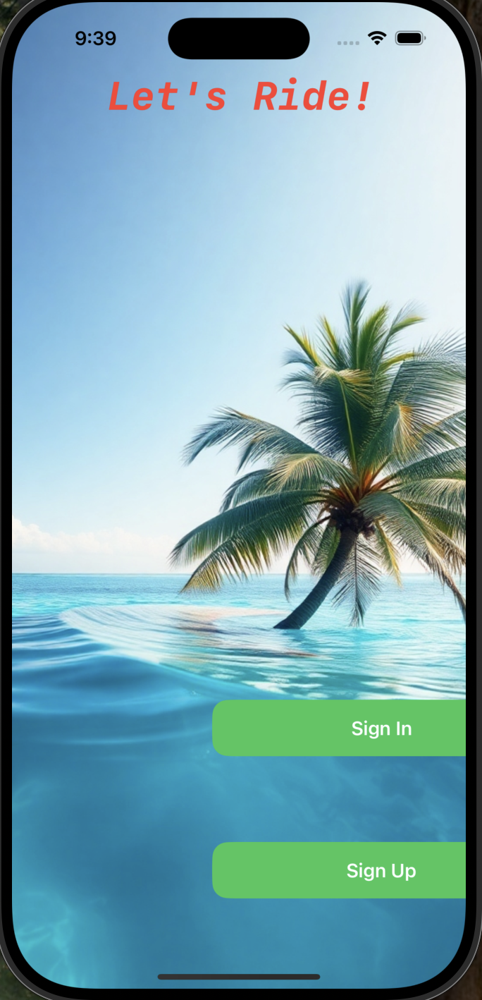
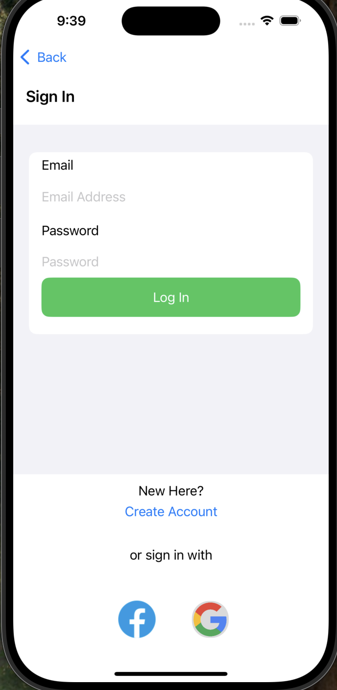
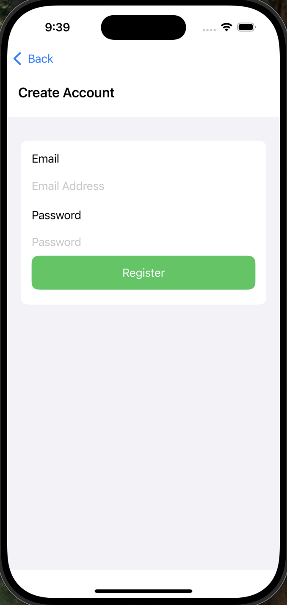
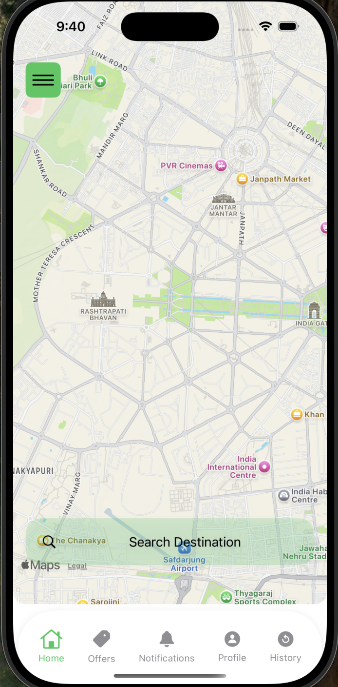
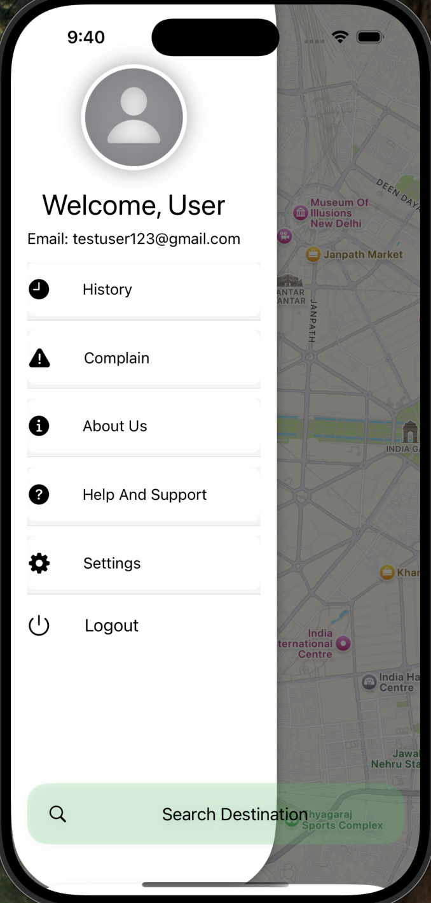
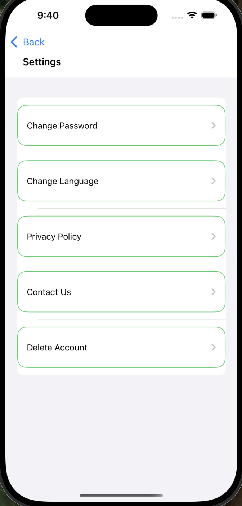
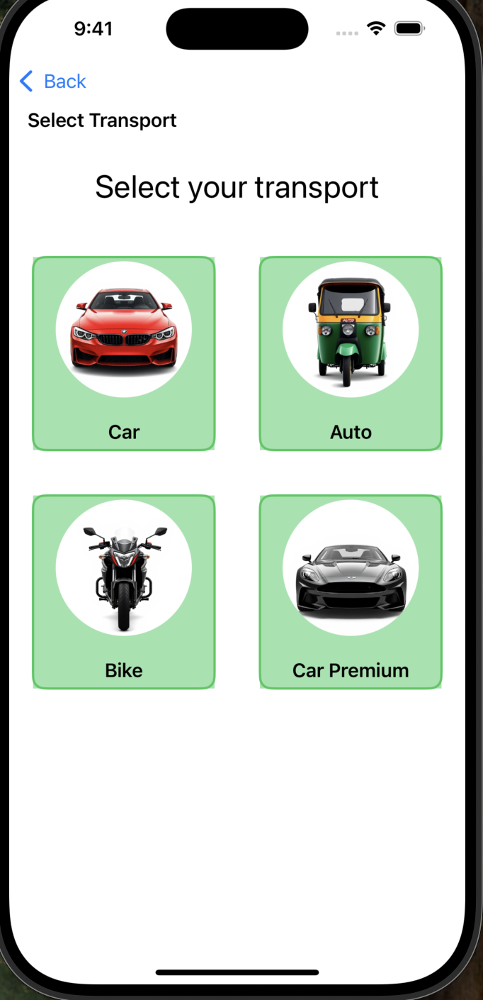
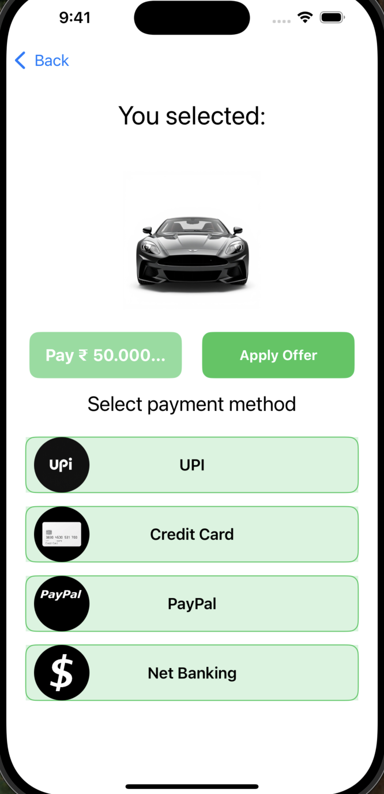
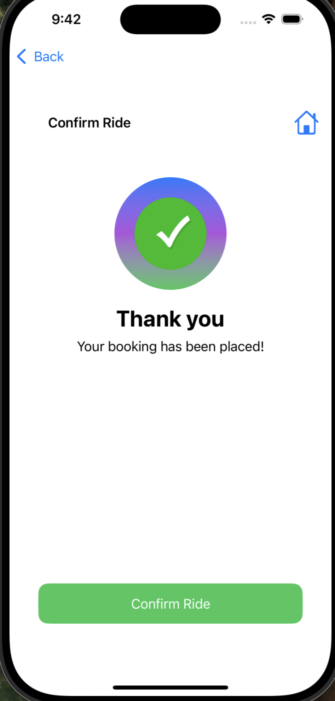
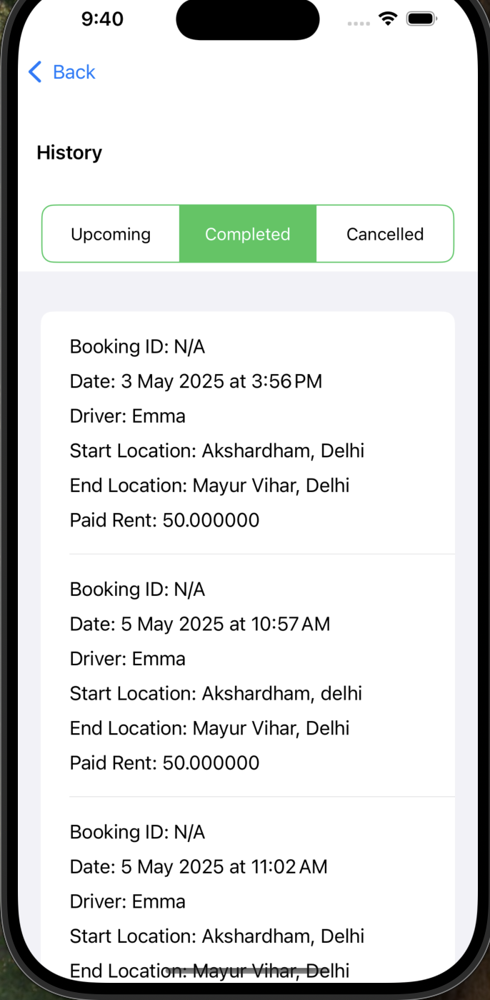

🚗 Tripzy – Ride Sharing App
Tripzy is a modern and user-friendly ride-sharing app built using Swift and SwiftUI. It offers seamless booking, real-time tracking, and a smooth user experience for both riders and drivers.

🌟 Features
✅ User Authentication – Secure login & registration with Firebase
✅ Ride Booking – Easily request rides with pickup and drop-off locations
✅ Real-Time Tracking – Live location updates of rides
✅ Payment Integration – Secure online payments (planned)
✅ History & Receipts – View past rides and invoices
✅ Dark Mode Support – Seamless UI for both light and dark mode

🛠️ Tech Stack
Swift & SwiftUI – For building a smooth and modern UI
Xcode – Development environment
Firebase – Backend services (Authentication, Database, Storage)
CoreData – Local data persistence
📷 Preview

  
  
  
  
  
  
  
  
  
  

🔧 Installation
Clone the repository: git clone https://github.com/Subham7481/Tripzy.git

Set up Firebase:
Go to Firebase Console
Create a new project
Add an iOS app and download the GoogleService-Info.plist file
Replace the existing GoogleService-Info.plist in the Xcode project

Open Tripzy.xcodeproj in Xcode
Run the app on a simulator or a real device

🤝 Contributing: Feel free to submit issues or pull requests if you want to improve Tripzy!

📜 License
This project is open-source and available under the MIT License.
